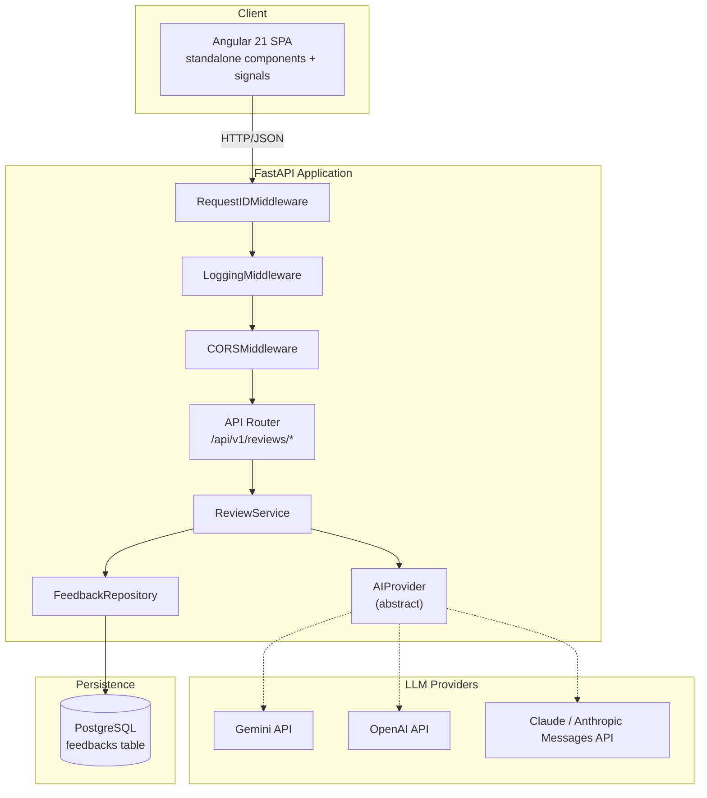
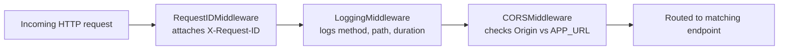
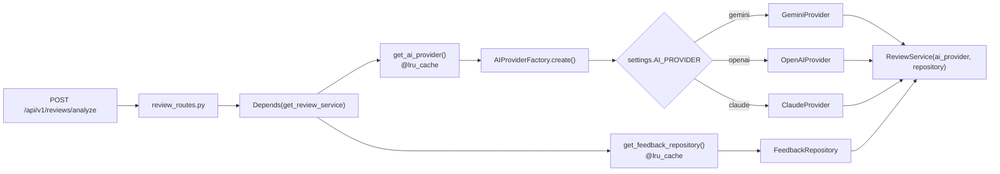
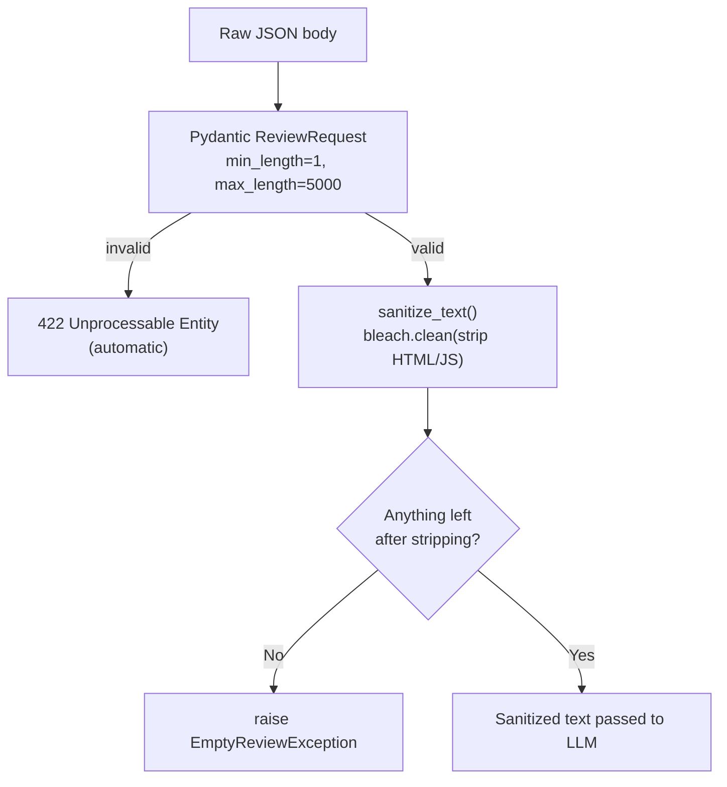
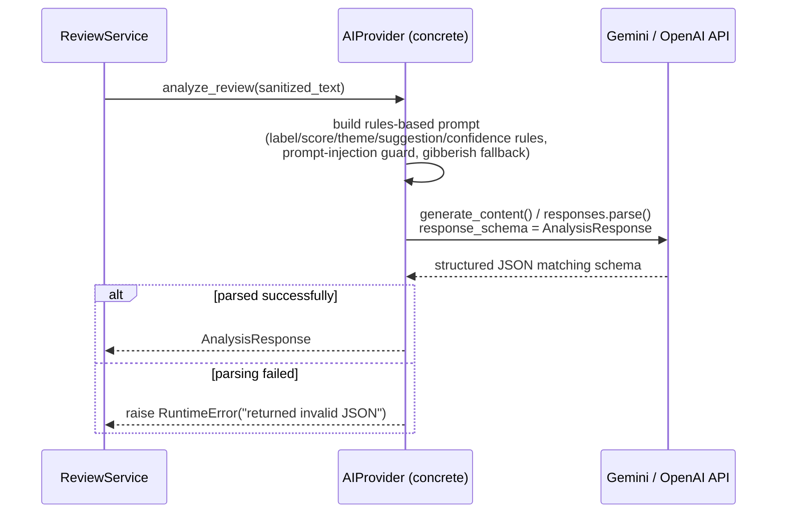
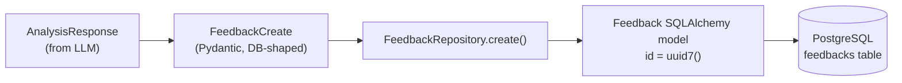
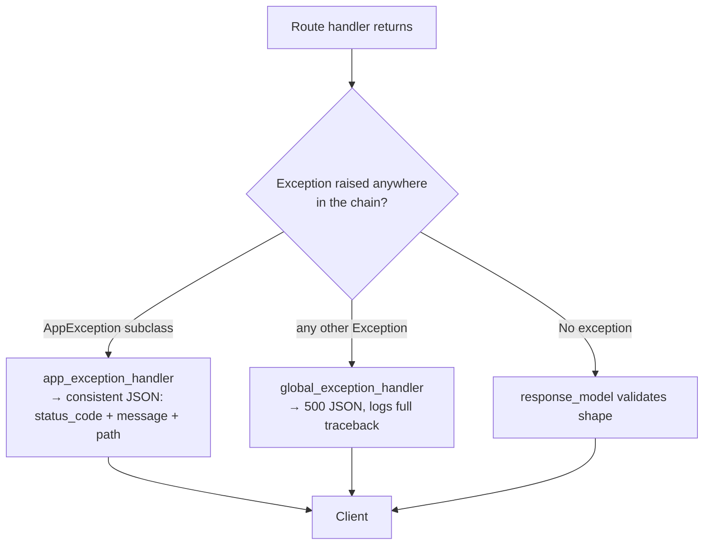
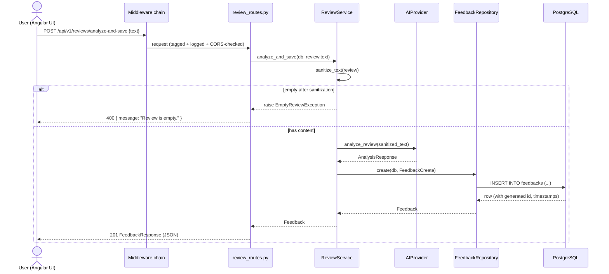
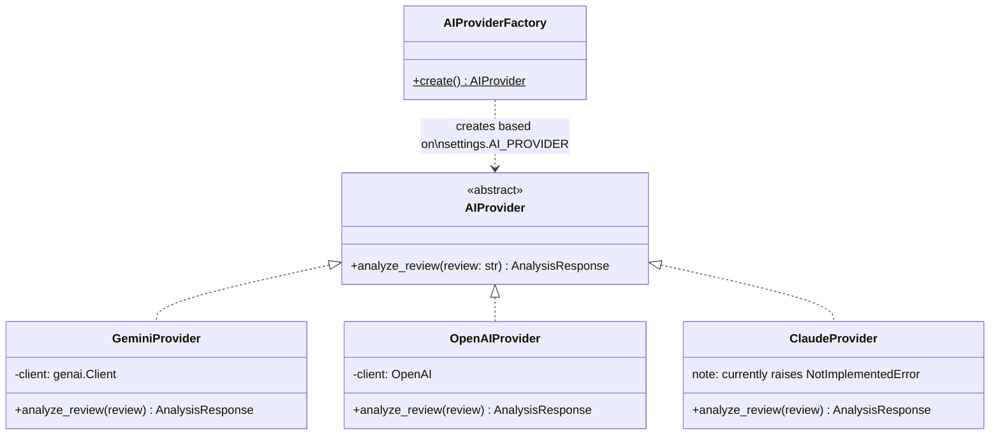
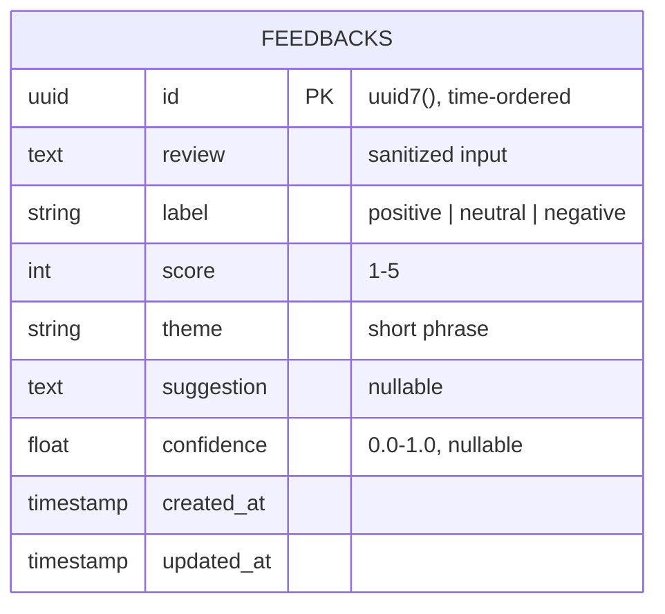

# Architecture - GenAI Customer Review Analyzer

> For the current router hierarchy, dependency lifetimes, and production latency guidance, see [`ARCHITECTURE.md`](./ARCHITECTURE.md). This longer document is retained for historical detail.

This document breaks the backend down step by step, with a Mermaid diagram and a short theory note for each stage, then zooms out to the full system design. Every diagram reflects what's actually implemented in `backend/app/`, not an aspirational design.

---

## 1. High-level system design

**Theory:** This is a classic **layered architecture**. Each layer only talks to the one directly below it - the router never touches the database, and the service never knows which concrete LLM it's calling. That separation is what makes the `AIProvider` swappable and the whole thing testable in isolation (you can unit-test `ReviewService` with a fake provider and a fake repository, no network or DB required).

---

## 2. Step-by-step backend flow

### Step 1 - Request enters through middleware

**Theory:** Middleware runs on *every* request before any route logic. `RequestIDMiddleware` tags each request with a unique ID so a specific client-side error can be traced to one exact log line - invaluable once you have more than one instance running. `LoggingMiddleware` gives you structured, consistent logs without every route handler having to remember to log anything. CORS is checked here because a browser's preflight `OPTIONS` request never even reaches your route handlers otherwise.

---

### Step 2 - Routing & dependency injection

**Theory:** FastAPI's `Depends()` plus `@lru_cache` gives you **singleton dependency injection with almost no boilerplate** - `get_review_service()` is only ever actually constructed once per process, then reused. The **Factory pattern** (`AIProviderFactory.create()`) reads `AI_PROVIDER` from `.env` and returns the matching concrete class. Because both `ReviewService` and every route only depend on the abstract `AIProvider` type, swapping Gemini for OpenAI or Claude is a one-line config change - no route, service, or repository code changes at all. This is the **Dependency Inversion Principle** (the "D" in SOLID) in practice.

---

### Step 3 - Input validation & sanitization

**Theory:** This is **defense in depth** across three layers: Pydantic rejects obviously malformed input before your code even runs; `bleach` strips any HTML/JavaScript so a review can't be used for a stored-XSS attack when later rendered in the Angular history table; and a business-rule check catches the case where sanitization leaves nothing meaningful (e.g. a review that was just a `<script>` tag). Each layer catches what the previous one can't.

---

### Step 4 - The LLM call itself

**Theory:** Both `GeminiProvider` and `OpenAIProvider` use **schema-constrained generation** (`response_schema=AnalysisResponse` / `text_format=AnalysisResponse`) rather than asking the model to "please return JSON" and hoping - the SDK enforces the shape at the API level. The prompt itself also does real prompt-engineering work: it defines an explicit fallback branch (`label="neutral"`, `confidence=0.0`) for gibberish/spam input instead of letting the model guess, and explicitly tells the model to treat everything after `"Customer Review:"` as inert data, not instructions - a basic but real prompt-injection defense.

---

### Step 5 - Persistence

**Theory:** Note the schema split: `AnalysisResponse` (what the LLM returns) and `FeedbackCreate` / `FeedbackResponse` (what the DB stores / API returns) are **separate Pydantic models**, even though their fields overlap heavily. That's intentional decoupling - if the LLM response shape ever changes, or you add DB-only fields (like `created_at`), you don't have to touch the AI layer. IDs use **UUIDv7** (`uuid6` package) instead of UUIDv4: v7 is time-ordered, so primary-key index writes stay sequential (better B-tree performance) while still being globally unique - you get `created_at`-like sortability for free from the ID itself.

---

### Step 6 - Response & error handling

**Theory:** A **custom exception hierarchy** (`AppException` → `FeedbackNotFoundException`, `AIProviderException`, `DatabaseException`, `ValidationException`, `EmptyReviewException`) means every error the app raises deliberately gets one consistent JSON shape and the *right* HTTP status code, instead of routes individually deciding what to return. The catch-all `global_exception_handler` is the safety net for anything unexpected - it still returns clean JSON (never a raw stack trace) while logging the real traceback server-side.

---

## 3. Full request lifecycle (end-to-end sequence)

**Theory:** This is the whole point of the SRP-driven layering visible in one diagram: the **route** only knows HTTP; the **service** only knows business rules (sanitize → analyze → persist, in that order, with the right short-circuit on empty input); the **provider** only knows "how do I talk to this specific LLM"; the **repository** only knows "how do I talk to Postgres for this table." No layer reaches past the one directly below it.

---

## 4. AI Provider factory (class view)

**Theory:** This is the **Strategy pattern** (interchangeable algorithms behind one interface) combined with a **Factory** (centralized construction logic). `ReviewService` is written once against `AIProvider` and never needs to change no matter how many LLM vendors you add - adding Claude Sonnet, Azure OpenAI, or a local Ollama model later is purely additive: one new class implementing `analyze_review()`, one new branch in the factory, zero changes anywhere else.

---

## 5. Data model

**Theory:** Storing the LLM's raw judgment (`label`, `score`, `theme`, `suggestion`, `confidence`) alongside the sanitized input text means the history/dashboard views in Angular never need to re-call the LLM - every past analysis is fully reconstructable from one row, which keeps repeat page loads fast and free.

---

## 6. Known gap vs. a "textbook enterprise" layout

The planning notes for this project describe a fully versioned `api/api.py` → `api/v1/router.py` → feature routers structure so `/api/v1` and a future `/api/v2` could run side by side. As shipped today, `app/main.py` includes `review_router` directly with `prefix="/api/v1"` - simpler, and perfectly fine at this project's current size, but it means introducing a v2 later would mean touching `main.py` directly rather than adding one router file. Worth revisiting if/when a breaking API change is needed.
