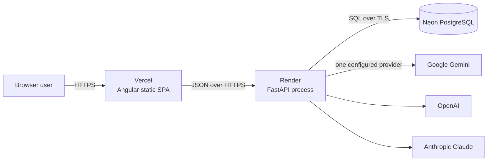
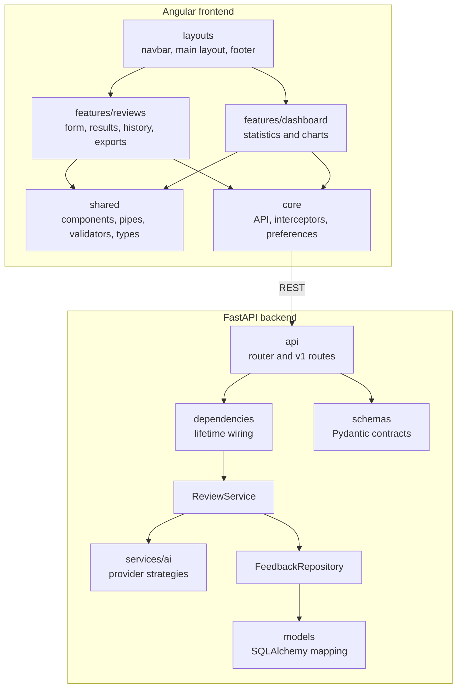
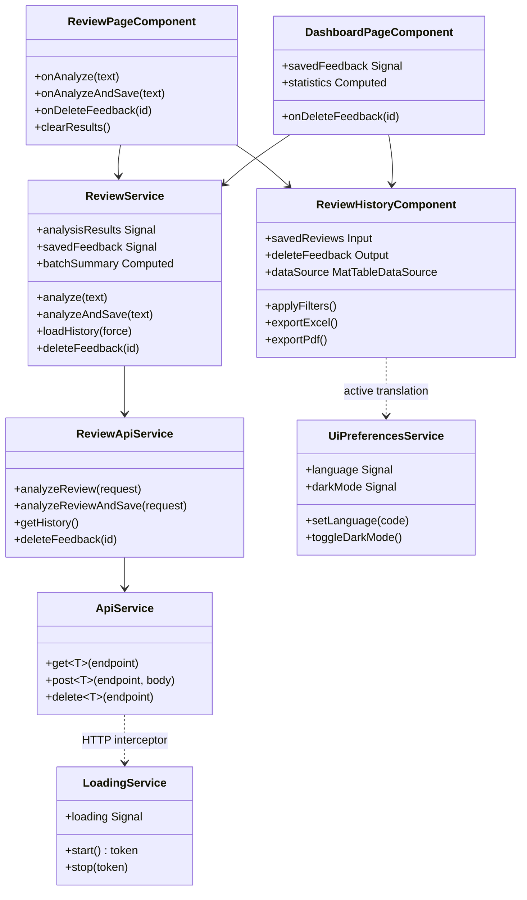
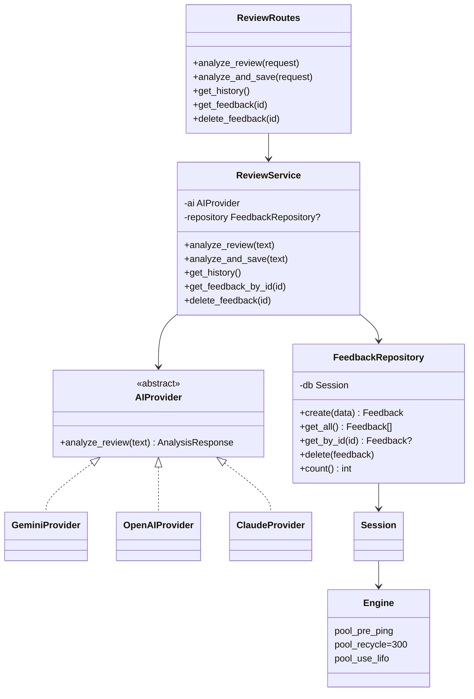
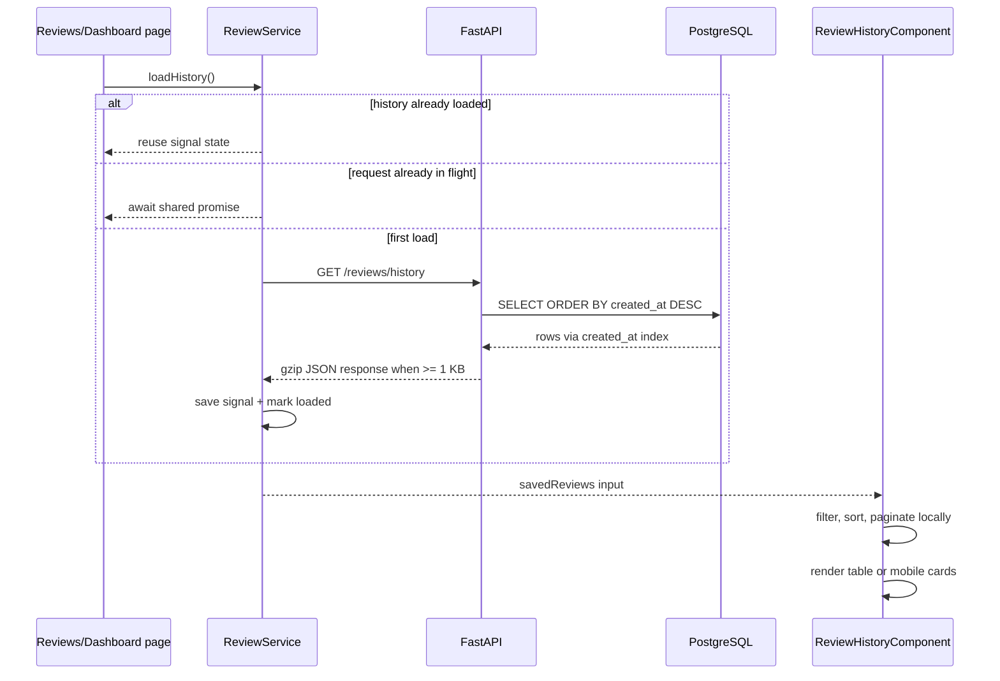
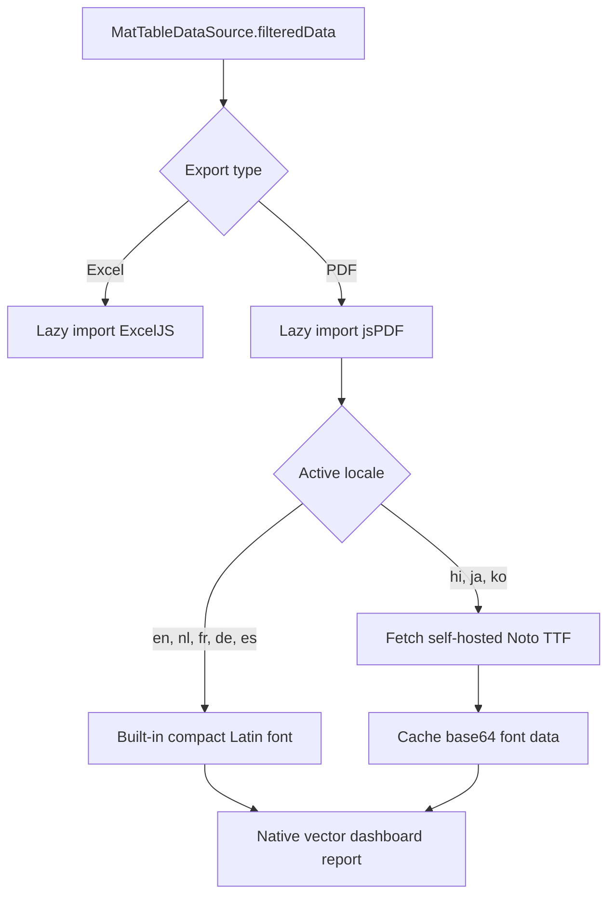
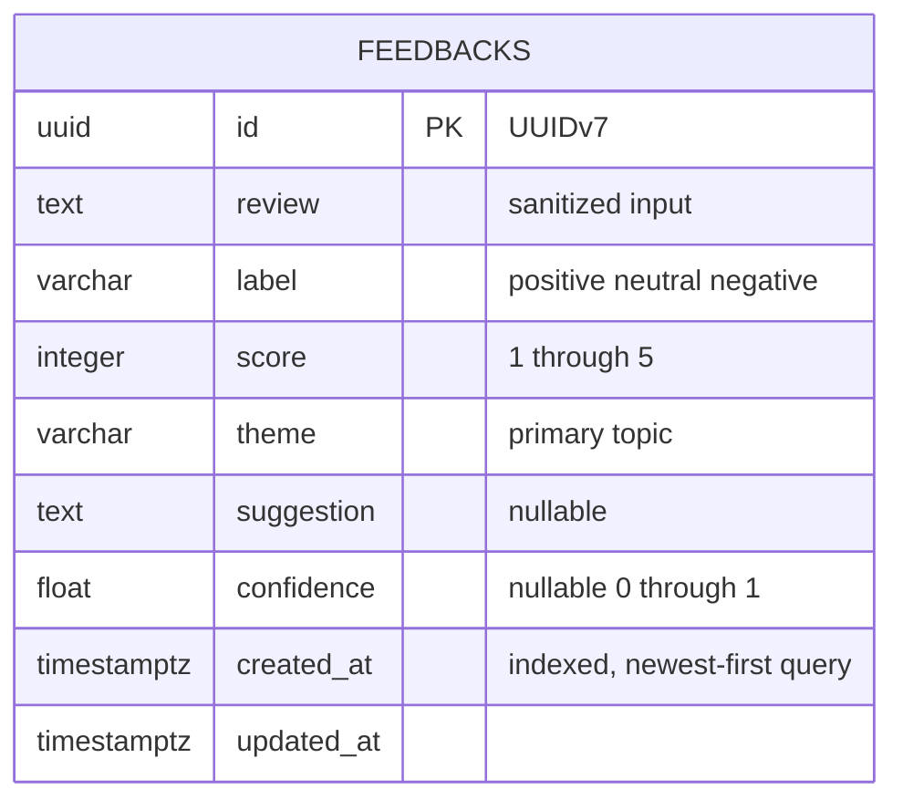
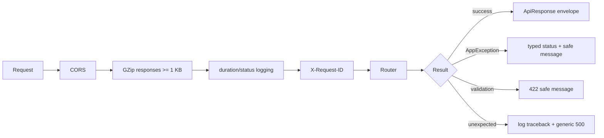
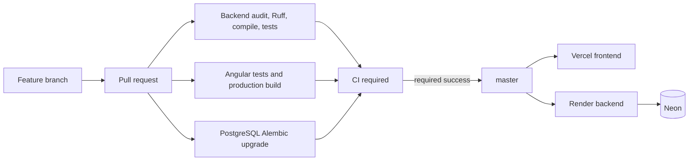

# Low-Level Design

This document describes the implemented classes, dependencies, state transitions, request flows, storage model, and performance decisions of the GenAI Customer Review Analyzer. It complements the higher-level overview in [`ARCHITECTURE.md`](./ARCHITECTURE.md).

## 1. Runtime context



Only one AI provider is constructed per backend process. `AI_PROVIDER` selects the strategy at startup. Database sessions remain request-scoped.

## 2. Source-module map



Cross-feature frontend imports use `@app/*`; environment imports use `@env/*`. Component-local files may use `./`.

## 3. Frontend class relationships



### Frontend state ownership

| State | Owner | Lifetime | Consumers |
|---|---|---|---|
| Saved feedback | `ReviewService.savedFeedback` | Application | Reviews, Dashboard, History |
| Session results | `ReviewService.analysisResults` | Application until cleared/refresh | Reviews |
| History request cache | `ReviewService` | Application | Both lazy routes |
| API loading tokens | `LoadingService` | One token per subscription | Main layout loader |
| Language/theme | `UiPreferencesService` + local storage | Persistent browser preference | Entire application |
| Search/filter/sort/page | `ReviewHistoryComponent` | Component instance | Desktop table and mobile cards |

## 4. Backend class relationships and lifetimes



| Dependency | Lifetime | Reason |
|---|---|---|
| SQLAlchemy `Engine` | Process | Thread-safe connection pool |
| AI provider | Process, `lru_cache` | Reuse SDK client and connection pools |
| Analysis-only `ReviewService` | Process, `lru_cache` | Stateless and database-free |
| SQLAlchemy `Session` | Request | Transaction and ORM identity-map isolation |
| Repository-backed `ReviewService` | Request | Holds the request-scoped repository/session |

## 5. Analyze-and-save sequence

```mermaid
sequenceDiagram
    actor User
    participant Form as ReviewFormComponent
    participant State as ReviewService
    participant API as ReviewApiService
    participant INT as HTTP interceptors
    participant Route as FastAPI route
    participant Service as Backend ReviewService
    participant AI as AIProvider
    participant Repo as FeedbackRepository
    participant DB as PostgreSQL

    User->>Form: Submit review lines
    Form->>State: analyzeAndSave(text)
    State->>State: trim, remove blank lines
    par Up to three ordered workers
        State->>API: analyzeReviewAndSave(review)
        API->>INT: POST /reviews/analyze-and-save
        INT->>INT: request ID + loading token
        INT->>Route: JSON request
        Route->>Service: analyze_and_save(text)
        Service->>Service: sanitize text
        Service->>AI: analyze_review(text)
        AI-->>Service: AnalysisResponse
        Service->>Repo: create(FeedbackCreate)
        Repo->>DB: INSERT + COMMIT
        DB-->>Repo: persisted row
        Repo-->>Route: Feedback
        Route-->>INT: ApiResponse Feedback
        INT->>INT: release exact loading token
        INT-->>State: unwrapped Feedback
    end
    State->>State: preserve input order; update result/history signals
```

The frontend bounds concurrency at three requests. This reduces batch latency without creating an unbounded burst against Render or the selected LLM provider.

## 6. History, filtering, and deletion



Filters remain client-side so keyword, sentiment, theme, score, sorting, mobile cards, and exports all operate on one consistent set. The parsed filter object is cached per filter string instead of being reparsed once for every row.

Deletion always follows `three-dot menu -> confirmation dialog -> DELETE API -> signal update`. The UI removes the row only after the server confirms deletion.

## 7. PDF and spreadsheet export



The PDF keeps the original jsPDF vector layout; it does not use DOM screenshots. Only the locale-specific font is fetched, and repeat exports reuse converted font data. The Noto files are distributed under the SIL Open Font License in `public/fonts/OFL.txt`.

## 8. Persistence design



`ix_feedbacks_created_at` supports the current `ORDER BY created_at DESC` history query. UUIDv7 keeps primary-key inserts time-ordered and index-friendly.

## 9. Middleware and error flow



The frontend error interceptor translates HTTP classes into localized snackbars. Unexpected backend errors retain their traceback in server logs with the request path and request ID, while clients receive no stack trace.

## 10. Performance characteristics

| Area | Implemented decision | Effect |
|---|---|---|
| Routes | Angular lazy feature routes | Avoid loading both page components initially |
| Charts | Register only used Chart.js modules | Smaller chart runtime |
| Dashboard | One computed aggregation pass | Avoid repeated filters/maps over history |
| Lists | Stable `trackBy` keys | Reduce DOM recreation |
| Batch AI | Three bounded workers | Lower elapsed time with controlled load |
| History | Shared in-flight request and state cache | Avoid duplicate route-navigation fetches |
| Filtering | Cache parsed filter criteria | Avoid `JSON.parse` per row |
| File tools | Dynamic ExcelJS/jsPDF imports | Keep export libraries outside initial bundle |
| PDF fonts | Locale-only fetch + base64 cache | Avoid repeat conversion and unrelated fonts |
| API payloads | GZip at 1 KB | Reduce larger history response transfer |
| Database | Pre-ping, recycle, LIFO pool | Prefer warm connections and reject stale ones |
| History query | `created_at` index | Support newest-first ordering |

Cold Render/Neon startup and external LLM inference remain infrastructure/network costs. Application-level optimization cannot guarantee sub-second AI responses on sleeping infrastructure.

## 11. Scaling boundary and next design step

The current history endpoint returns the full saved collection because filtering, charts, and exports are client-side. This is appropriate for a portfolio/small-team dataset and keeps behavior simple. When history reaches thousands of rows, evolve the contract together:

1. Add cursor pagination and server-side search/filter/sort parameters.
2. Add a separate aggregate analytics endpoint.
3. Export through a background report job or streamed server response.
4. Cache aggregate results with explicit invalidation after create/delete.

Changing only the backend to paginate today would silently break dashboard totals, filters, and exports, so it is deliberately documented rather than applied as a partial optimization.

## 12. Security boundaries

- Pydantic limits request length before service execution.
- `bleach` sanitizes text before AI analysis and persistence.
- Prompt instructions treat review content as untrusted data.
- Provider keys remain backend environment variables and never reach Angular.
- CORS restricts browser origins to the configured frontend URL.
- There is currently no user authentication or tenant isolation; all review endpoints are public.
- Destructive UI actions require confirmation, but authorization must be added before multi-user production use.

## 13. Deployment and CI



GitHub branch rules should require the stable `CI required` status before merge. Deployment remains configured in Vercel and Render rather than performed by the repository workflow.
